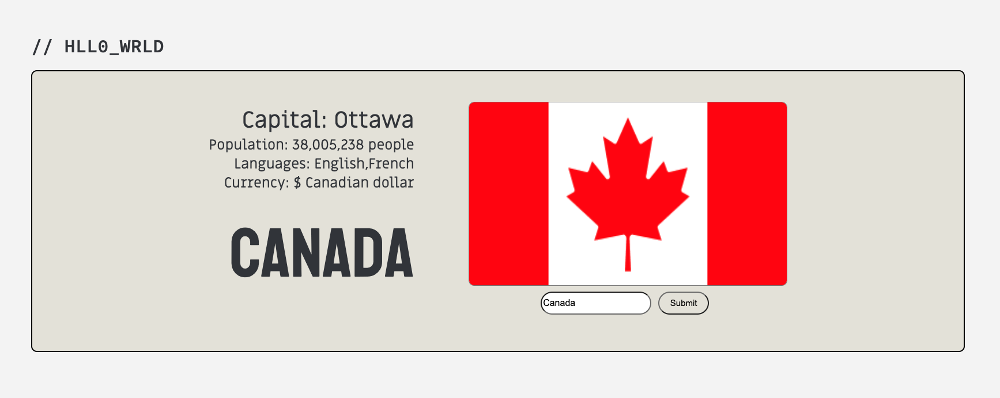

# <span style="font-family:Source Code Pro">// **HLLO_WRLD** <span>

    
Need a quick and easy way to check information about a country? 

Say hello, to <span style="font-family: Source Code Pro">// HLLO_WRLD.</span>

---


<!-- TABLE OF CONTENTS -->

<details>
<summary>Table of contents</summary>
<li><a href="#about-the-project">About the project</a></li>
<li><a href="#screenshots">Screenshots</a></li>
<li><a href="#getting-started">Getting Started</a></li>
<li><a href="#future-enhancements">Future Enhancements</a></li>
<li><a href="#author">Author</a></li>
</details>


---
## **About the  project**
### **Built with**


[![HTML5][html-img]][html-url]<br>
[![CSS][css-img]][css-url]<br>
[![JavaScript][js-img]][js-url]<br>
[![Google Fonts][google-fonts-img]][google-fonts-url]<br>
 [![jQuery][jquery-img]][jquery-url]<br>
[![API][api-img]][api-url]

<div align="right">
    <a href="#top">🔝</a>
</div>

---

## **Screenshots**



<div align="right">
    <a href="#top">🔝</a>
</div>

---

## **Getting Started**

Project Link: <a href="https://hello-world-rose-sigma.vercel.app/" target="_blank">[// HLLO_WRLD]</a>

<div align="right">
    <a href="#top">🔝</a>
</div>

---


## **Future Enhancements**

- Google Maps for users to navigate the country search
- Save a searched country to localstorage
- Ability to search multiple countries and display at the same time using a carousel

<div align="right">
    <a href="#top">🔝</a>
</div>

---

## Author
```
const aboutMe: = {
    firstName: "Arjay",
    lastName: "Beltran",
    githubUsername: "arjybltrn"
}
```
<div align="right">
    <a href="#top">🔝</a>
</div>


<!-- markdown links and images-->
[html-img]: https://img.shields.io/badge/5-HTML-red
[html-url]: https://developer.mozilla.org/en-US/docs/Glossary/HTML5
[css-img]: https://img.shields.io/badge/3-CSS-yellow
[css-url]: https://developer.mozilla.org/en-US/docs/Web/CSS
[js-img]: https://img.shields.io/badge/JS-JavaScript-black
[js-url]: https://developer.mozilla.org/en-US/docs/Web/JavaScript
[google-fonts-img]: https://img.shields.io/badge/%20-Google%20Fonts-blue
[google-fonts-url]: https://fonts.google.com/
[jquery-img]: https://img.shields.io/badge/%20-jQuery-success
[jquery-url]: https://jquery.com/
[api-img]: https://img.shields.io/badge/%20API-Rest%20Countries-important
[api-url]: https://restcountries.com/


